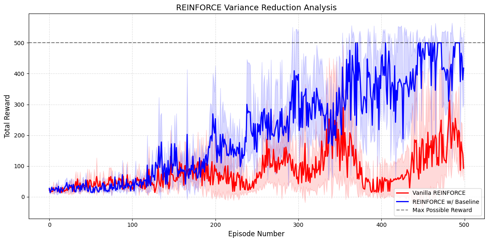
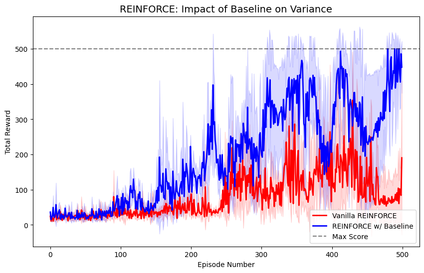

# REINFORCE with Variance Reduction (CartPole-v1)

**Author:** Barsha Kakshapati  
**Institution:** Regis University  
**Course:** MSDS - Data Science Practicum  

## 🚀 Project Overview
This repository contains a PyTorch implementation of the **REINFORCE** algorithm (Monte Carlo Policy Gradient) applied to the `CartPole-v1` environment. The project evaluates the performance impact of a **State-Value Baseline** on training stability and convergence.

In Reinforcement Learning, policy gradients are notoriously noisy. By implementing a baseline estimate $V(s)$, we center our returns to reduce variance while maintaining an unbiased estimator.

## 📊 Performance Analysis
The results below highlight the critical difference between vanilla policy gradients and those optimized with a baseline.

### 1. Variance Reduction Comparison
This plot demonstrates how the **Baseline (Blue)** significantly tightens the confidence interval and stabilizes the rewards compared to the **Vanilla (Red)** version.



### 2. Training Convergence
This visualization tracks the reward progression, showing the speed at which the baseline agent reaches the environment's maximum threshold.



### **Key Observations:**
* **Stability:** The Baseline version (Blue) displays a much narrower shaded region, proving that gradient updates are more consistent across different random seeds.
* **Efficiency:** While Vanilla REINFORCE (Red) eventually solves the task, it suffers from significant "dips" in performance, whereas the Baseline version stays locked at the 500-reward ceiling.

## 🛠️ Technical Implementation
* **Policy Network:** Feed-forward NN with 128 hidden neurons using `Categorical` distribution for action sampling.
* **Value Network:** A critic network used to estimate $V(s)$ and compute the advantage: $A = G_t - V(s)$.
* **Data Handling:** Custom `pad_sequences` logic to process inhomogeneous training data across multiple seeds.

## 📋 Dependencies
* Python 3.9+
* `torch`
* `gymnasium`
* `numpy`
* `matplotlib`

## 💻 Getting Started
1. **Clone the repository:**
   ```bash
   git clone [https://github.com/your-username/MSDS-Lab6-PolicyGradients.git](https://github.com/your-username/MSDS-Lab6-PolicyGradients.git)
